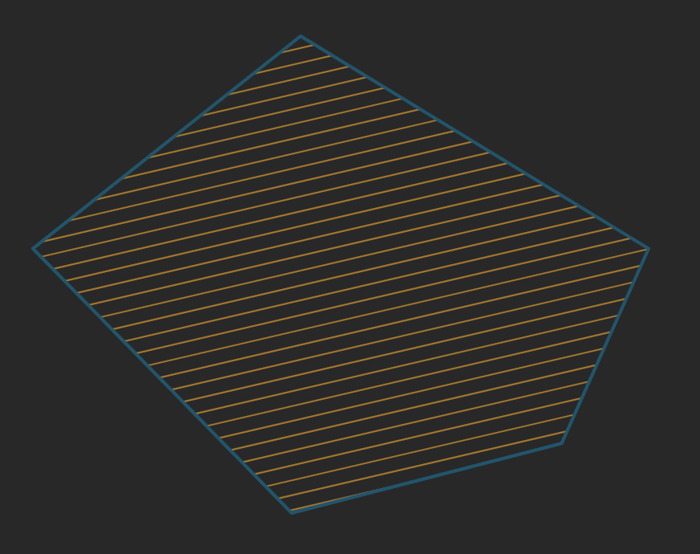

# polygon-crosshatching

Fill a convex polygon with crosshatching defined by a particular spacing and at
a particular angle. This is a umd build so it can be included in the browser or
in your node app.

# Usage

`polygonCrosshatching(polygon, spacing, angle)`
+ `polygon` The convex polygon in which the crosshatching will be placed
+ `spacing` spacing The density of the crosshatching
+ `angle` The angle that the crosshatching is created in radians

The `polygon` input is a polygon in list form
```js
[
  [x1, y1], // Vertex 1
  [x2, y2], // Vertex 2
  [x3, y3], // Vertex 3
  ...
]
```

The output is a list of line with the points in list form
```js
[
  [[x1, y1], [x2, y2]], // one line
  [[x1, y1], [x2, y2]], // another
  ...
]
```

### Example in code
```js
// Browser include
<script src="./node_modules/polygon-crosshatching/build.js"></script>
// this incldues the global function `polygonCrosshatching` into the namespace

// Node's CJS Include
const poylgonCrosshatching = require('polygon-crosshatching');

const polygon = [
  [   0,   0 ],
  [ 100,   0 ],
  [ 120, 100 ],
  [  50, 200 ],
  [  20, 100 ]
];
const spacing = 5;
const angle = Math.PI / 3; // 30deg

const hatches = polygonCrosshatching(polygon, spacing, angle);
// output is a list of lines
```

### Example output

