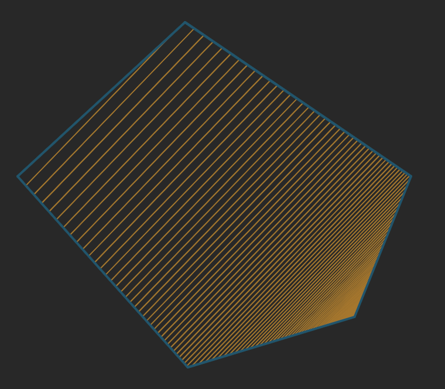

# polygon-crosshatching

Fill a convex polygon with crosshatching defined by a particular spacing and at
a particular angle. This is a umd build so it can be included in the browser or
in your node app.

# Usage

`polygonCrosshatching(polygon, angle, start_density, [end_density])`
+ `polygon {Point List}` The convex polygon in which the crosshatching will be placed
+ `angle {Number}` The angle that the crosshatching is created in radians
+ `start_density {Number > 0}` The starting spacing density of the crosshatching
+ `end_density {Number > 0}` The ending spacing density of the crosshatching

The `polygon` input is a polygon in a list of all the verticies
```js
[
  [x1, y1], // Vertex 1
  [x2, y2], // Vertex 2
  [x3, y3], // Vertex 3
  ...
  [xn, yn] // Last Vertex
]
```

The output is a list of line with the points in list form
```js
[
  [[x1, y1], [x2, y2]], // one line
  [[x1, y1], [x2, y2]], // another
  ...
]
```

### Example in code
```js
// Browser include
<script src="./node_modules/polygon-crosshatching/build.js"></script>
// this incldues the global function `polygonCrosshatching` into the namespace

// Node's CJS Include
const poylgonCrosshatching = require(polygon-crosshatching);

const polygon = [
  [   0,   0 ],
  [ 100,   0 ],
  [ 120, 100 ],
  [  50, 200 ],
  [  20, 100 ]
];
const spacing = 5;
const angle = Math.PI / 3; // 30deg

const hatches = polygonCrosshatching(polygon, angle, spacing);
// output is a list of lines

const ending_spacing = 50;

// To create a gradient from the starting angle to the ending angle within the polygon
const gradient_hatching = polygonCrosshatching(polygon, angle, spacing, ending_spacing);
```

## Example Uniform Spacing


## Example Gradient



# Change Log

## Version 1.1.0
Added in the gradient crosshatching and changed the arrangement of the arguments in the function from `(polygon, spacing, angle)` to `(polygon, angle, spacing_start, spacing_end)` for better consistency and extensability.